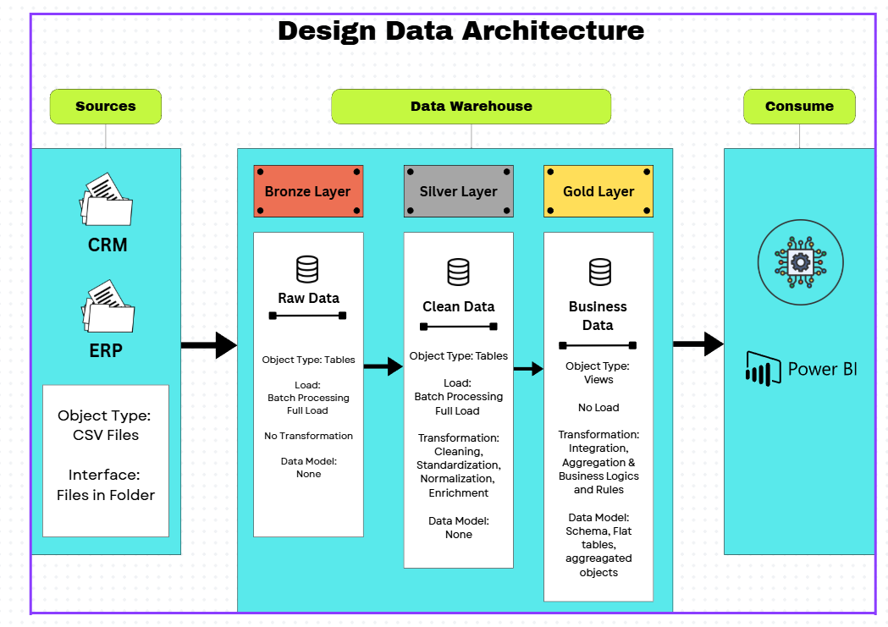

# Data Warehouse and Analytics Project 

Welcome to the **Data Warehouse and Analytics Project** repository! 🚀

This project demonstrates a comprehensive data warehousing and analytics solution, from building a data warehouse to generating actionable insights. Designed as a portfolio project, it highlights industry best practices in data engineering and analytics. 

---

## 🚀 Project Requirements

### Building the Data Warehouse (Data Engineering)

#### Objective
Develop a modern data warehouse using MYSQL Server to consolidate sales data, enabling analytical reporting and informed decision-making.

#### Specifications
- **Data Sources:** Import data from two source systems (ERP and CRM) provided as CSV files.
- **Data Quality:** Cleanse and resolve data quality issues prior to analysis.
- **Integration:** Combine both sources into a single, user-friendly data model designed for analytical queries.
- **Scope:** Focus on the latest dataset only; historization of data is not required.
- **Documentation:** Provide clear documentation of the data model to support both business stakeholders and analytics teams.

---

### BI: Analytics & Reporting (Data Analysis)

#### Objective
Develop SQL-based analytics to deliver detailed insights into:

- **Customer Behavior**
- **Product Performance**
- **Sales Trends**

These insights empower stakeholders with key business metrics, enabling strategic decision-making.

---

## 🏗️ Data Architecture
This diagram illustrates the flow of data across different layers of the warehouse, including ingestion, transformation, and analytical modeling.

  

This project is built using a layered architecture approach:

- **Bronze Layer** → Raw data ingestion from source systems (CRM & ERP)
- **Silver Layer** → Data cleaning, standardization, and transformation
- **Gold Layer** → Business-ready data model (Star Schema)

---

## 🧱 Data Layers

#### 🥉 Bronze Layer
- Stores raw data exactly as received from source systems
- No transformations applied
- Serves as the single source of truth

#### 🥈 Silver Layer
- Cleans and standardizes data
- Handles nulls, duplicates, and inconsistencies
- Prepares structured datasets for analysis

#### 🥇 Gold Layer
- Business-ready layer
- Implements **Star Schema**
- Optimized for reporting and analytics

---

## 🛡️ License
This project is licensed under the [MIT License](LICENSE). You are free to use, modify, and share this project with proper attribution.

## 🌟 About Me
Hi there! I'm Tannistha, also known as Tan;). I’m a third year computer science student specializing in data science and applying my knowledge here to track my progress and understanding. Thankyou 
